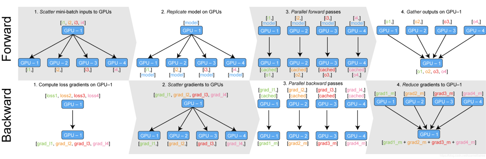

+++
author = "陈银鹏"
title = "使用Pytorch进行单机多卡分布式训练"
date = "2021-10-26"
description = ""
featured = true
categories = ["技术"
]
tags = ["pytorch",
]
series = [
]
aliases = []
images = [
]
toc = true

+++

# 一. torch.nn.DataParallel ?

pytorch单机多卡最简单的实现方法就是使用nn.DataParallel类，其几乎仅使用一行代码`net = torch.nn.DataParallel(net)`就可让模型同时在多张GPU上训练，它大致的工作过程如下图所示：

在**每一个Iteration**的**Forward**过程中，nn.DataParallel都**自动**将输入按照gpu_batch进行split，然后**复制**模型参数到各个GPU上，分别进行前传后将得到网络输出，最后将结果concat到一起送往0号卡中。

在**Backward**过程中，先由**0号卡**计算loss函数，通过`loss.backward()`得到损失函数相于各个gpu输出结果的梯度grad_l1 ... gradln，接下来0号卡将所有的grad_l送回对应的GPU中，然后GPU们分别进行backward得到各个GPU上面的模型参数梯度值gradm1 ... gradmn，最后所有参数的梯度汇总到GPU0卡进行update。

> 注：DataParallel的整个并行训练过程利用**python多线程**实现

由以上工作过程分析可知，nn.DataParallel有着这样几个无法避免的问题：

1. 负载不均衡问题。gpu0所承担的任务明显要重于其他gpu
2. 速度问题。每个iteration都需要复制模型且均从GPU0卡向其他GPU复制，通讯任务重且效率低；python多线程GIL锁导致的线程颠簸(thrashing)问题。
3. 只能单机运行。由于单进程的约束导致。
4. 只能切分batch到多GPU，而无法让一个model分布在多个GPU上。当一个模型过大，设置batchsize=1时其显存占用仍然大于单张显卡显存，此时就无法使用DataParallel类进行训练。

因此官方推荐使用torch.nn.DistributedDataParallel替代nn.DataParallel.

# 二. torch.nn.Parallel.DistributedDataParallel !
