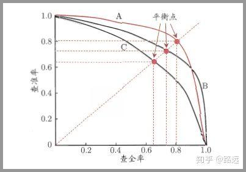
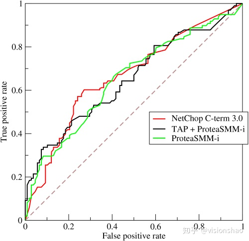

+++
author = "陈银鹏"
title = "分类器性能评估"
date = "2022-6-28"
description = ""
featured = true
categories = ["技术"
]
tags = ["机器学习",
]
series = [
]
aliases = []
images = [
]
toc = true

+++

## Precision & Recall

**Precision中文名查准率，精确率：表示预测为正样本的样本集中真正正样本的比例**

**Recall中文名查全率，召回率：表示真正为正样本的样本集中被预测为正样本的比例**

$$P=TP/(TP+FP)$$

$$R=TP/(TP+FN)$$

其中TP，TN，FP，FN的T/F代表预测是否正确（True/False），P/N代表预测结果是正样本还是负样本（Positive/Negative）

**Accuracy准确率的定义为预测正确的样本占总样本集的比例**

$$A=(TP+TN)/(TP+TN+FP+FN)$$

可以看到Precision与Recall更关注正样本的预测情况，而accuracy同时关注正负样本的预测情况

Precison与Recall随着正样本阈值（0~1，一般为0.5）的改变所呈现出的曲线就被称为**P&R**曲线,该曲线所围的面积越大，说明分类效果越好，而从图中也可以看到，Precison与Recall实际上是两个有些矛盾的指标，查的越准就越难查全，查的越全就越难查准。

由于**P&R**曲线所围面积并不是很容易估算，所以常使用F score来综合考虑查准率与查全率的影响：
$$
F_\beta=(1+\beta^2)PR/(\beta^2P+R)
$$
$$
F_1=2PR/(P+R)
$$
可以看到F socre中$$\beta$$越大代表查全率越重要，反之代表查准率越重要。而F1 score为$\beta=1$的特殊情况，是Precision与Recall的调和平均数,

**ROC曲线与AUC面积**

ROC全称为受试者工作特征，是另一种评估模型综合性能的度量方式。

定义真正率（就是召回率）$$TPR=TP/(TP+FP)$$

定义假正率（判读错误的正样本占所有负样本的比例）$$FPR=FP/(TN+FP)$$

则ROC曲线就是以真正率为纵轴，假正率为横轴的一条曲线。由于ROC计算时仅仅只用正负样本子集做分母，因此其不受样本不平衡的影响。类似于PR曲线，ROC曲线也是通过遍历不同阈值所绘制而成，ROC所围面积**AUC**越大代表模型分类性能越好，也就是说TPR越大越好，FPR越小越好，曲线越靠左上角越好。

相比于PR曲线，ROC曲线更不容易收到样本不平衡的影响，因为随着测试集中负样本的增加召回率不受影响，精确率却会随之降低，而假正率由于分子分母同时会增大，也基本不受影响。因此ROC相比于PR曲线更适合与测试样本严重不均衡的情况，但是PR曲线更加直观的表示我们所关心的正样本表现出的查准率与查全率。

那么对于同一个模型而言：如果测试集样本由平衡转化为不平衡（负样本数量增多），带来的后果是：查全率不变，查准率下降，假正率几乎不变，F1下降，PR曲线所围面积下降，AUC几乎不变。

